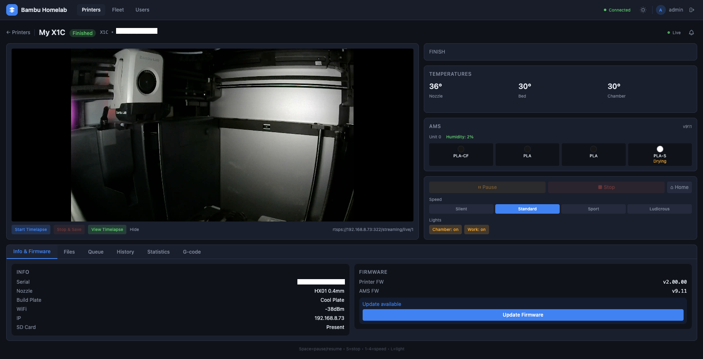

# Bambu Homelab

A self-hosted fleet management platform for Bambu Lab 3D printers. Replaces Bambu Cloud and Bambu Handy with a fully independent system that runs entirely on your local network.

<p align="center">
  
</p>

## Why this exists

I bought a Bambu Lab X1C that turned out to be region-locked to mainland China. No Bambu Cloud, no Bambu Handy, no remote access of any kind. The printer works fine over the local network via its built-in MQTT and FTPS interfaces, but there was no way to monitor or control it from a phone or another machine without the official cloud services.

So I built my own.


## What it does

- **Real-time monitoring** of all your Bambu Lab printers (temperatures, print progress, AMS filament status, camera feeds)
- **Remote control** from your browser (pause, resume, stop, speed adjustment, light toggle)
- **File management** (upload 3MF files, browse SD card, start prints)
- **Print queue** with auto-start on completion
- **Print history and statistics** tracked per printer
- **Fleet dashboard** with aggregate stats across all printers
- **Timelapse capture** with automatic stitching
- **User management** with role-based access (admin / read-only user)
- **Live camera streaming** via RTSP-to-HLS relay

Supports 50+ printers on the same network.

## Architecture

```
Bambu Printers (MQTT on LAN:8883)
    |
Bridge (connects to each printer over MQTT, translates to protobuf)
    |
NATS JetStream (internal message bus, TLS + NKey auth)
    |
API (REST + WebSocket, JWT auth, PostgreSQL)
    |
Dashboard (Angular web app)
```

All backend services are written in Rust and run in Docker. The Angular dashboard runs locally during development.

## Requirements

- **Docker** and **Docker Compose**
- **Node.js** 20+ (for the Angular dashboard)
- One or more **Bambu Lab printers** on your local network with LAN mode enabled

### Printer setup

Before adding a printer, you need its LAN credentials:

1. On your printer's touchscreen, go to **Settings > Network > LAN Mode**
2. Enable LAN mode if not already on
3. Note the **Access Code** shown on screen
4. Note the printer's **IP address** (Settings > Network)
5. Note the **Serial Number** (Settings > General or printed on the back)

## Installation

### 1. Clone the repository

```bash
git clone https://github.com/YOUR_USERNAME/bambu-homelab.git
cd bambu-homelab
```

### 2. Run the setup script

This generates TLS certificates, NATS authentication keys, and environment files. Everything runs inside Docker containers so nothing is installed on your system.

```bash
./scripts/setup-dev.sh
```

You should see output like:

```
=== Bambu Homelab Dev Setup ===
  Generating TLS certificates...
  Certs written to .local/certs/
  Generating NKeys...
  NKeys written to .local/nkeys/
  .env.docker written (gateway + API)
  .env.bridge written (bridge on host network)

=== Setup complete ===
```

### 3. Start the backend

```bash
docker compose up -d
```

This starts:

| Service | Description |
|---------|-------------|
| **nats** | Message bus (internal communication between services) |
| **postgres** | Database (users, printers, print history) |
| **gateway** | Telemetry stream consumer |
| **api** | REST API + WebSocket server (port 3000) |
| **bridge** | Connects to your printers over the LAN |
| **video-relay** | Converts RTSP camera streams to HLS |
| **hls** | Serves camera streams to the browser |
| **timelapse** | Captures frames for timelapse videos |

### 4. Get the admin password

On the first run, an admin account is auto-created with a random password:

```bash
docker compose logs api | grep -A3 "admin"
```

You will see something like:

```
  First run - admin user created
  Username: admin
  Password: a1b2c3d4e5f6
  Change this password on first login!
```

Save this password. You can change it after logging in.

### 5. Start the dashboard

```bash
cd dashboard
npm install
npx ng serve
```

Open your browser to **http://localhost:4200** and log in with the admin credentials from step 4.

### 6. Add your first printer

1. Click **+ Add Printer** on the dashboard
2. Enter the printer's **name** (anything you want), **IP address**, **serial number**, and **access code** from the printer setup step above
3. Click **Add**

The printer should appear on the dashboard within a few seconds. If the printer is on and connected to your network, its status will show as "Online" with live telemetry.

## Usage

### Dashboard

The main page shows all your printers as cards with live status: temperatures, print progress, AMS filament, and online/offline indicators.

Click a printer card to open the detail view with:
- Live camera feed
- Temperature graphs (30-minute history)
- Print progress with elapsed time and ETA
- AMS filament tray status
- Control panel (pause/resume/stop, speed, lights)
- File browser and print start
- Print queue management
- Print history and statistics

### Keyboard shortcuts (printer detail page)

| Key | Action |
|-----|--------|
| Space | Pause / Resume |
| S | Stop print |
| 1-4 | Set speed (Silent / Standard / Sport / Ludicrous) |
| L | Toggle chamber light |

### User management

The admin can create user accounts for customers or other people who need to monitor prints.

**Users (non-admin) can only:**
- View printers assigned to them (read-only)
- See live telemetry, camera, print history, and statistics
- They cannot send commands, start prints, upload files, or manage anything

**To assign a printer to a user:**
1. Go to **Users** page (admin only)
2. Click **+ Assign** next to the user
3. Select a printer from the list

**To revoke access:**
- Click **Remove** next to the assigned printer
- The user is kicked from the printer view immediately (real-time via WebSocket)

### Fleet overview

The **Fleet** page shows aggregate statistics across all printers: how many are online, printing, idle, or errored, total print time, and a fleet-wide filament inventory.

## Updating

Pull the latest code and rebuild:

```bash
git pull
docker compose up -d --build
cd dashboard && npm install
```

The API runs database migrations automatically on startup, so no manual migration steps are needed.

## Troubleshooting

### Printer shows as "Offline"

- Make sure the printer is powered on and connected to your network
- Verify LAN mode is enabled on the printer
- Check the printer's IP address hasn't changed (router may reassign IPs)
- Check bridge logs: `docker compose logs bridge`

### WebSocket keeps reconnecting

- The dashboard reconnects automatically with exponential backoff
- Check API logs: `docker compose logs api`

### Camera stream not loading

- Video relay and HLS services must be running: `docker compose up -d video-relay hls`
- Click "Click to load camera stream" on the printer detail page
- Camera streams use RTSP which requires the printer to be on the same network

### Cannot log in

- Check the admin password: `docker compose logs api | grep -A3 "admin"`
- The password is only printed on the very first startup. If you lost it, delete the database volume and restart: `docker compose down -v && docker compose up -d`

## Project structure

```
bambu-homelab/
  crates/
    api/          Axum REST API + WebSocket server
    bridge/       Multi-printer MQTT connection manager
    gateway/      NATS JetStream telemetry consumer
    shared/       Protobuf definitions, config types, errors
  dashboard/      Angular 19 web application
  proto/          Protobuf schema files
  config/         NATS server configuration template
  scripts/        Setup scripts
  services/       Video relay and timelapse service scripts
  migrations/     SQL migration files (also inlined in API)
```

## Developer reference

See [AGENTS.md](AGENTS.md) for architecture details, API endpoints, database schema, NATS subjects, and design principles.

## License

[MIT](LICENSE)


## Disclaimer

This project is not affiliated with, endorsed by, or sponsored by Bambu Lab. "Bambu Lab" and "X1C" are trademarks of Shenzhen Tuozhu Technology Co., Ltd. This software communicates with Bambu Lab printers using their publicly available LAN protocols. Use at your own risk. The authors are not responsible for any damage to your printers, prints, or other equipment resulting from the use of this software.